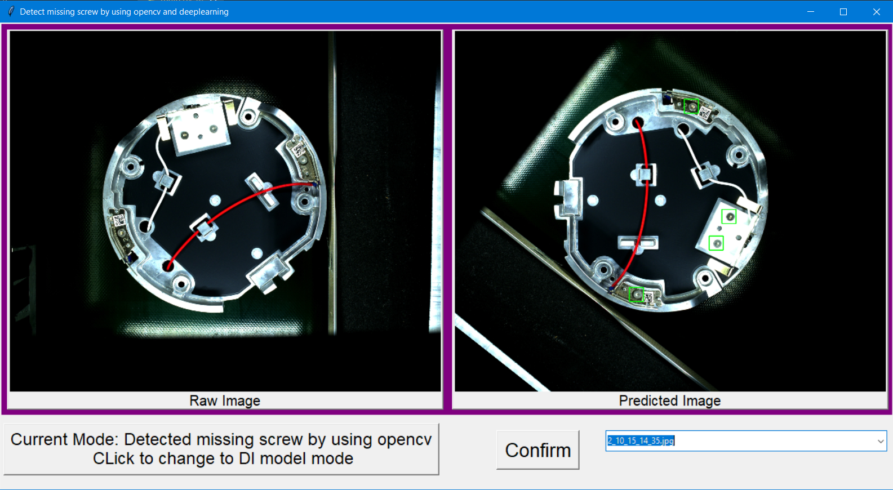
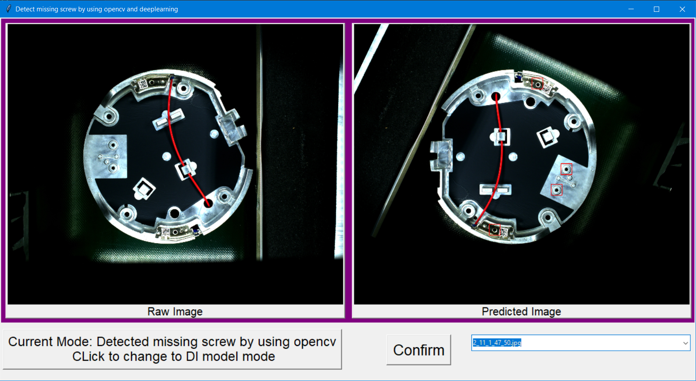

# Missing_screw

-  Yêu cầu: Xác định thiết bị 1 loại có thiếu ốc vít hay không bằng model deep learning và xử lí ảnh thông thường kết hợp với opencv.

- Trong phần này bạn chạy file main.py để bắt đầu, Nếu xác định thiếu thì ở khu vực đó sẽ được khoanh lại bằng một ô vuông màu đỏ, còn nếu đủ ốc vít thì sẽ được khoanh bằng ô vuông xanh.
# Preview:
- Detect trong thiết bị đã đủ ốc vít ở các khu vực yêu cầu:

- Detect khi thiết bị lỗi không phát hiện đinh vít:

